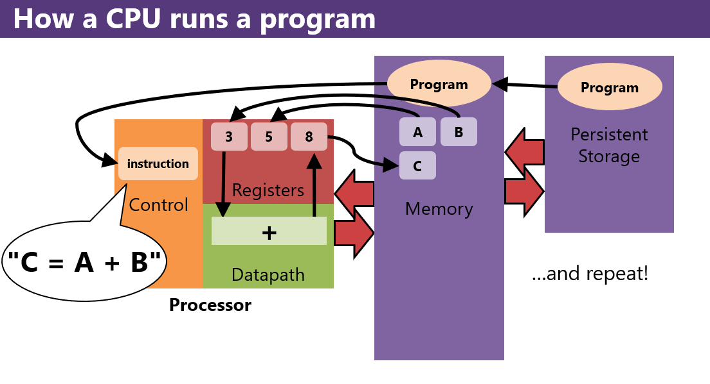

# Lecture 3 - Programs, Instruction, Registers

## Important to remember
* 8 bits = 1 byte
* a byte  = 2 hex digits
* loads copy from memory to registers
* stores copy from registers to memory

## Basic definitions
* an instruction is a single operation (i.e., step) for the computer to do
* a program is a series of these tiny instructions
* machine language instructions are the pattersn of bits that a processor reads to know what to do 
* assembly language is a human-readable, textual representation 
   * encoded as a 32 bit 
  
## Compilers
* convert source code into object files
  * object files - contain files
  * shove the object file to a linker, which makes the executable
* executbable = what is it, how big is it, what types of features does it use and require

## Virutal Machines
* Split the compiler and linker, and add an extra step
* Intermediate language code = microsoft's name
* virtual machine finishes the job, takes the intermediate code and makes it into machine code
  * usually with a JIT (just-in-time compiler)
* same basic concept as a compile, plus an extra layer

# How a CPU runs a program?
## Abstract answer:
1. read an instruction
2. does what it says
3. go to step 1

* top to bottom
* the CPU can only do stuff from memory
* control unit = the brains of the processer
  * reads instructions
  * carry outs steps, delegates
* registers are like hands, like very small memory within the CPU



# ISA
* Instruction set architecture: the interface that a CPU presents to the programmer
  * what it defines
   * What the CPU should be expecting 
   * what patterns of bits mean what things
   * Defines what the CPU can do (add, subtract, call, etc.)
   * What registers it has
   * the machine language 
  * it does not define:
   * How to design the hardware (if any hardware at all, like the Java VM) 
  * you can run programs written in 1978 on a brand new CPU (fun fact), backwards compatibility x1,000
  * ISA example: x86 
   * Any CPU or program from 1978+
 * Kinds of ISAs (2 classes):
   * CISC: Complex Instruction Set Computer (here because of x86)
     * ISA designed for humans to write asm
     * lots of instructions and ways to use them
     * complex instructions
    * x86 is *very* CISCy
 * RISC
    * Reducts Instruction set Computer
    * build the CPU hardware
    * make that hardware run fast
    * write compilers that make machine code
    * generate machine to spit out algo code
    * instructions are very simple
    * MIPS is *very* RISCy
* popular ISAs
  * most x86 are laptops, desktops, and servers
  * (phones, Nintendo Switch) = ARMs (Acorn RISC machine)
    * Takes after MIPS
    * everything else = other ISAs
  * despite its limited use, MIPS has been incredibly influential
  * concepts from MIPS are broadly applicable 

# Registers

## What is a register
* registers are a kind of small, fast, temporary memory inside the CPU
* a handful of numbers
* in MIPS there are 32 registers
* the CPU can only operate on data within the registers
* MIPS has 32 registers, each is 32 bits (one word)
* register dollar signs -> Jarrett got rid of 'em, modified MARS, so we don't have to use 'em

## How to think about registers
* are registers variables? No. They are a temporary holding place for values.
* think: working hands, the juggler
* registers = a temporaty stopping ppoint for those values
* important stuff is in memory > less important is stuff is in registers

## Notes on Registers
* you cannot write every program using registers
* every peice of your program has to share the registers 
* there is a lot of discipline when writing assembly language

# Types of registers

| types         | registers      |
|---------------|----------------|
| arguments     | a0, a1, a2, a3 |
| return values | v0, v1         |
| temporaries   | t0, t1, ... t9 |
| "saved"       | s0, s1, ... s7 |

* for anything that isn't an argument or return value…
  1. use a t register.
  2. unless you need the value to persist across a function call (jal).
  
## MIPS Instructions
```
li t0, 3        # t0 = 3
li t1, 5        # t1 = 5
add t2, t0, t1  # t2 = t0 + t1
```
* `li` = load immediate, loads a constant value

* you only have a limited number! you must reuse registers.
* every register and variable always holds something.
    * when you put something in a register, it will stay there forever
    * until you put something else into it.
* values are always, always copied.

# Notes
* https://jarrettbillingsley.github.io/teaching/classes/2201/cs0447/
