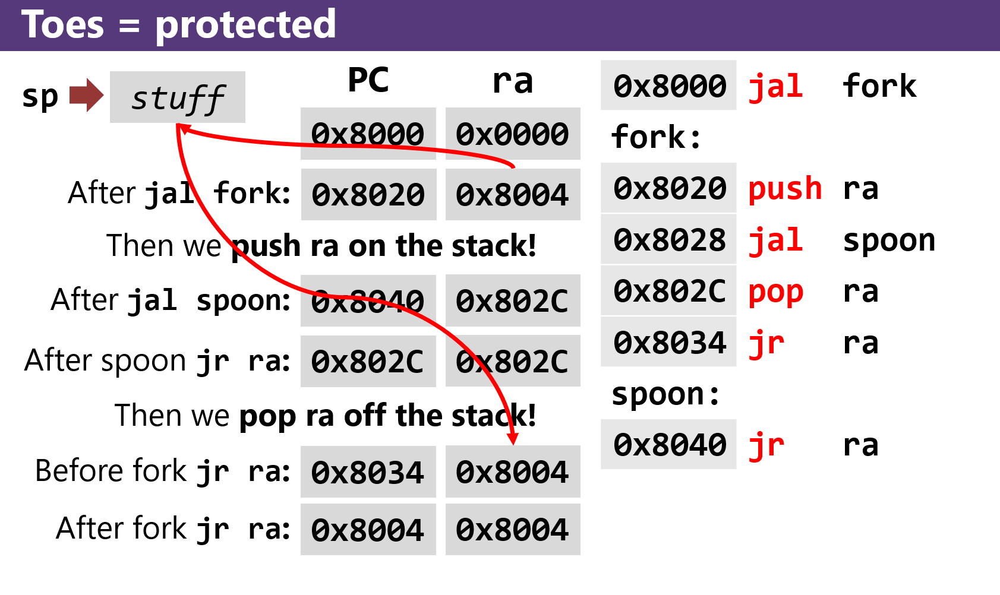

# Functions

## What's a calling convention? 
* we need rules for humans
* it ensures our programs don't trip over their own feet
* every function in your program must share the same registers
* how machine language functions call one another
  * how arguments are passed (a-registers)
  * how return values are returned (v-registers)
  * how control flows into/out of the function
  * what contracts exist between the caller and callee


## Program Counter (PC)
* a programs instructions are in memory, so they have addresses
* the PC holds the address of the **next instruction to run**
* each instructions are 4 bytes, one word
* you cannot edit/modify **pc** registers
* 0, 4, 8, C <- multiples of 4 in bits

* side note: if a branch instruction is false, it just goes to the next instruction

### MIPS ISA: jal
* `jal`: jump and link; what we use for f(x) calls
* a jump is just assigning a different address value in **pc** register
  * we still have to remember where we are... (we use the ra register to remember what instruction we need to run after the instruction)
* links back to the old one in the **ra** (return address) register
* you can think of **ra** like a bookmark (or like a breadcrumb)
* YOU ONLY HAVE ONE BOOKMARK (THERE IS ONLY ONE ra REGISTER)

### MIPS ISA: jr
* `jr`: jump to address register
* at the end of the function still has the proper return address
* what it does --> copies whatever value is in **ra** to **pc**, going back to where we left off
* it's following the bookmark back

``` 
.globl main
main:
   jal fork
   
   # to gracefully send the program
   li v0, 10 
   syscall
 
fork: 
   push ra # if we don't have will cause an infinite loop
   jal spoon
   pop ra # if we don't have will cause an infinite loop
   
   jr ra
   
 spoon:
   jr ra
 
```
* without the push/pop
* we lose the first bookmark, because we overwrote it 
|                    | PC         | RA         |
|--------------------|------------|------------|
|                    | 0x8000     | 0x0000     |
| after `jal fork:`  | 0x8020     | 0x8004     |
| after `jal spoon:` | x8040      | **0x8024** |
| after `jr ra:`     | **0x8024** | **0x8024** |
| after `jr ra:`     | **0x8024** | **0x8024** |
| after `jr ra:`     | **0x8024** | **0x8024** |
| after `jr ra:`     | **0x8024** | **0x8024** |

|        | mem addr  | instruction |
|--------|-----------|-------------|
|        | 0x8000    | jal fork    |
|        | 0x8004    | li v0, 10   |
|        |    ...    |    ...      |
| fork:  | 0x8020    | jal spoon   |
|        | 0x8024    | jr ra       |
|        |    ...    |    ...      |
| spoon: | 0x8040    | jr ra       |

### Call stack
* we have a tiny, busy desk that three people have to share
  * the desk is the registers.
  * the people are functions.
  * the stack of stuff is… the stack. (where good people store stuff into memory)
* what is te stack?
  * an area in memory provided to your program by the OS
  * the stack holds information about function calls:
    * the return addres to the caller
    * copies ofof registers that we want to change 
    * local variables/arguments that can't fit in the registers
* how do we access the stack?
 * through the **sp** (stack pointer register)
 
 
 
* **you should use push and pop in functions** before jr ra
* you don't need unless you have a `jal` within a function (a call within a function)
* if you have multiple function calls, you only need to push/pop once

#### Stack pointer
* we want to push something on the stack
* the first thing we'll do is move sp to the next available slot
* clearly, that's the previous address (... lol...)
  * subtract 4 from sp
  * then, we can store something in the memory that sp points to.


```
fork:

   # push
   sub sp, sp, 4
   sw  ra, (sp) # store ra at the address that sp holds
 
# now the value in ra is saved on the tack, and we can get it back later.
# and we can store as many return addresses as we want!

  # pop - inverse of push
  lw ra, (sp)
  add sp, sp, 4
 
# now stack and ra are the same as before
# called "balancing the stack**
 
  jr ra

```
* making sure **sp** ends up where it started calling "balancing the stack**
  * Jarrett added `push ra` and `pop ra` 
  
  `push ra` = 
  ```
  sub sp, sp, 4 
  sw ra, (sp)
  ```
  
  `pop ra` = 
  ```
  lw ra, (sp) 
  add sp, sp, 4
  ```
* You only have to push/pop ra once in each function!
* ONLY PUSH/POP REGISTERS AT THE BEGINNINGS AND ENDS OF FUNCTIONS

# Writing a Function

1. Give it a name (label)
2. Save **ra** to the stack (`push ra`)
3. Do whatever
4. Load **ra** from the stack (`pop ra`)
5. return (`jr ra`) 

* only need to push/pop registers ar the beginnings 
* if you need something in t --> save as an s

### Arguments and Return Values
* v0 is the return
* we put whatever we want to return in v0 before we `jr ra`
* caller side:

1. put the arguments in the **a#** register
2. call the function (w/jal)
3. if it returns values, look at the **v#** register

* must move stuff from v0 into a0 (return into arguments)
* if you need to store an a0, save it in an s-register

# Questions
* How do we keep track of a0?
* 
