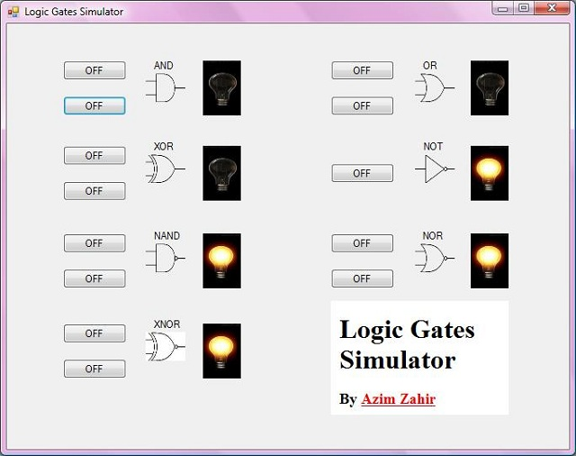
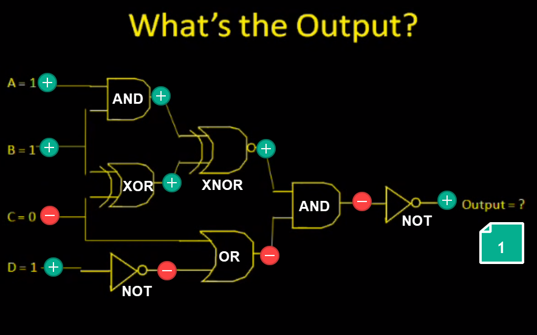

# Logical Gates
* takes one electrical computer, can determine how computer processes information
* basic gates
  * AND - only true when A and B are both turned on
  * OR - only true when A or B, at least one is turned on
  * NOT - opposite/converse/inverter
  * NAND - opposite of AND, only off if both turned off
  * NOR - opposite of OR, turn only if A and B are zero
  * XOR - exclusive or, turn only if one value is turn (e.g., soup or salad), one or the other
  * XNOR - opposite of XOR
* Can be used to create a logical circuit

## Truth Table
| A | B | AND | OR | NOT (A) | NAND | NOR | XOR | XNOR |
|:-:|:-:|:---:|:--:|:-------:|:----:|:---:|:---:|:----:|
|   |   |  ∧  |  ∨ |  ¬ ~ !  |   ⊼  |  ⊽  | ⊕ ⊻ |      |
| 0 | 0 |  F  |  F |    F    |   T  |  T  |  F  |   T  |
| 0 | 1 |  F  |  T |    F    |   T  |  F  |  T  |   F  |
| 1 | 0 |  F  |  T |    T    |   T  |  F  |  T  |   F  |
| 1 | 1 |  T  |  T |    T    |   F  |  F  |  F  |   F  |

## Visualization with Lights

*source: https://www.codeproject.com/KB/cs/UnderstandingLogicGates/image.jpg*

# Logic Circuit
## Example

*source: https://youtu.be/q2OBYz3K6PM*

## Note
* Be careful some gates won't work, as they're circular
* Always simplify the circuit before you create the logical gate
 * Use less circuits in real life
 * How: factor out terms 

# Resources
* https://youtu.be/q2OBYz3K6PM
