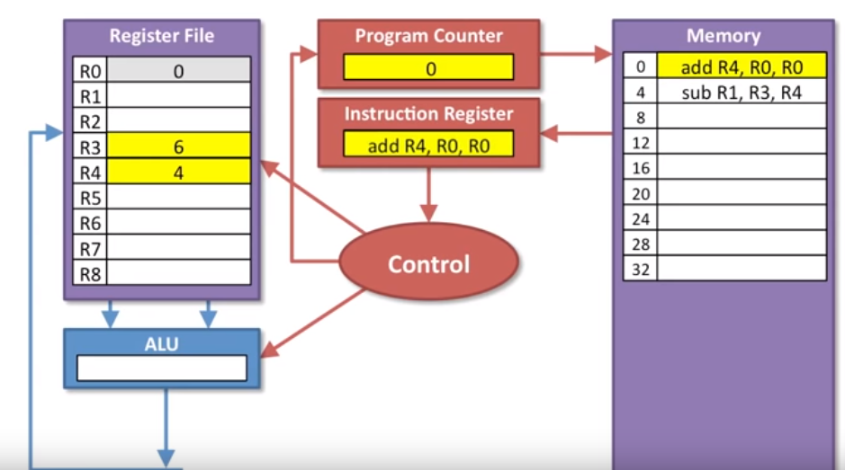
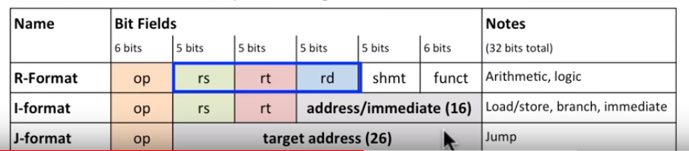
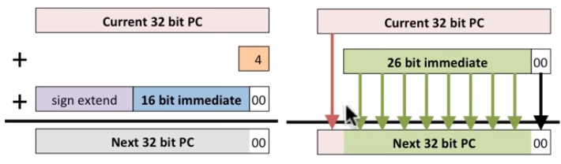
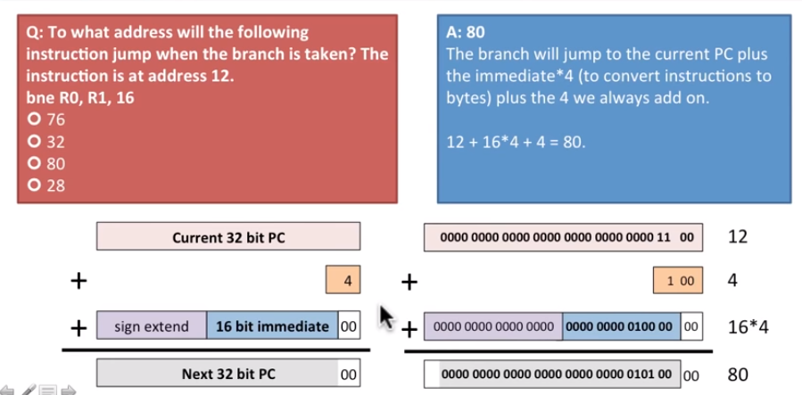

# MIPS
# 1.1 Instruction Set Architecture

## How do we program a processor?
 * high level language (must) -> compiler (which converts to) -> assembly code (which then translates into) -> machine code
    * assembly = instructions for the processor
    
## What does the processor do?
  * what do we have:
      * memory (big and slow)
      * current instruction
      * data registers: can hold a bit of data to work on (small and fast)
      * computations: is told by control what data (from data registers) to use 
      * control: decodes the instruction to tell the processor what to do (the brains)
      
 
# 1.2 MIPS instructions
## Format
* operation destination, source1, source2
    * e.g.:
        * `add a, b, c`  # a = b + c
        * `addi a, b, 12 ` # a = b + 12 
            * note: add immediate only needs two source registers
        * `sub a, b, c` # a = b - c
* to do complex operations, must break into steps (and use temporary registers)

## Instructions

| Function                   | Instruction        | Effect                                   |
|----------------------------|--------------------|------------------------------------------|
| add                        | `add r1, r2, r3`   | r1 = r2 + r3                             |
| subtract                   | `sub r1, r2, r3`   | r1 = r2 - r3                             |
| add immediate              | `addi r1, r2, 145` | r1 = r2 + 145                            |
| multiply                   | `mult r2, r3`      | hi, lo = r1 * r3                         |
| divide                     | `div r2, r3`       | low = r2/r3, hi = remainder              |
|----------------------------|--------------------|------------------------------------------|
| and                        | `and r1, r2, r3`   | r1 = r2 & r3                             |
| or                         | `or r1, r2, r3`    | r1 = r2 | r3                             |
| and immediate              | `and r1, r2, 145`  | r1 = r2 & 145                            |
| or immediate               | `or r1, r2, 145`   | r1 = r2 | 145                            |
| shift left logical         | `sll r1, r2, 7`    | r1 = r2 << 7                             |
| shift right logical        | `srl r1, r2, 7`    | r1 = r2 >> 7                             |
|----------------------------|--------------------|------------------------------------------|
| load word                  | `lw r1, 145(r2)`   | r1 = memory[r2 + 145]; 145 is the offset |
| store word                 | `sw r1, 145(r2)`   | memory[r2 + 145] - r1                    |
|----------------------------|--------------------|------------------------------------------|
| load upper immediate       | `lui r1, 145`      | r1 = 145 << 16                           |
| branch on equal            | `beq r1, r2, 145`  | if (r1 == r2) go to PC + 4 + 145*4       |
| brand on not equal         | `bne r1, r2, 145`  | if (r1 != r2) go to PC + 4 + 145*4       |
| set on less than           | `slt r1, r2, r3`   | if (r2 < r3) r1 = 1, else r1 = 0         |
| set on less than immediate | `slt r1, r2, 145`  | if (r2 < 145) r1 = 1, else r1 = 0        |
|----------------------------|--------------------|------------------------------------------|
| jump                       | `j 145`            | go to 145                                |
| jump register              | `jr r31`           | go to r31                                |
| jump and link              | `jal 145`          | r31 = PC + 4; go to 145                  |

## Registers in MIPS
* how many? 32
      * r0 -> r31
* how big is each? 32 bits
* each register called? a word

|     | Register file                       |
|-----|-------------------------------------|
| r0  | 0 (r0 is always zero)               |
| r1  | --MIPS registers can hold 32 bits-- |
| r2  |                                     |
| ..  |                                     |
|     |                                     |
|     |                                     |
| r29 | used for function calls             |
| r30 | used for function calls             |
| r31 |                                     |

* **values for instructions must come from the register**
* r0 is always zero (0)

# 1.3 Memory Organization (versus Register)
* MIPS is a load-store register file machine
      *  meaing: instructions computer only on data in the register file
* memory = big and slow, most of the data is stored here
* register = small (32 registers x 32 bits) and fast

## Load-store architecture
* Data must be transfered from memory to the register file to use it
* **Load**: load from from memory to the register file; `lw`
* **Store**: store data to the memory from the register; `sw`

## Memory organization
* in MIPS, memory is a large one-dimensional aray 
* each location is one byte (8 bits) ((IMPORTANT: Registers are 4 bytes, i.e., 32 bits))
* memory addresses indexes into the array 
   * for a 32-bit computer, there are 232 locations
      * largest address = 232 - 1

| Address                                | Memory                                      |
|----------------------------------------|---------------------------------------------|
| 4,294,967,295 (i.e., 232-1) | memory holds 8 bits of data (i.e., 2 bytes) |
| 4,294,967,294                          |                                             |
| ...                                    |                                             |
| ...                                    |                                             |
| ...                                    |                                             |
| ...                                    |                                             |
| 2                                      |                                             |
| 1                                      |                                             |
| 0                                      |                                             |

## Memory vs. Registers
* it takes 4x memory addresses to fill up 1x registers (or 1x word or 32 bits)
* **4x memory addresses = 1x register**

|                                 | Memory                            | Register                     |
|---------------------------------|-----------------------------------|------------------------------|
| Locations                       | +4 billion addresses (for 32-bit) | 32 registers                 |
| Speed                           | Slow                              | Fast                         |
| Each address holds (bits)       | 8                                 | 32                           |
| Each address holds (bytes)      | 1                                 | 4 (32 bits/(8 bits / 1byte)) |
| Each address holds (hex values) | 1/2                               | 2                            |

## Viewing memory/ alignment 
* **word-aligned**: looking at data in terms of a word (numbering each based 32 bit groupings)
* **byte-addressable**: looking at data in multiples of bytes

# 1.4 Instruction Execution Model
* n/a

# 1.5 Data Operation Instructions
## Data Operations
* we have: memory, register, ALU (arithmatic logic unit) (i.e., the thing doing te mathmatic computations), and program counter
* what is the process?

      1. program counter holds the instruction address
      2. instructions are fetched from meory into the instruction register
      3. control logic decodes the instruction and tells the ALU and register file what to do
      4. ALU executes the instruction and results flow back into the register file
      5. the control logic updates the program counter for the next instruction

* Note: the program counter must increment **4 bytes** to go to the next instruction

# 1.6 Data Transfer Instructions
* we have: adding a memory address and a data register + *everything we had for data operation instructions*
* what is the process of data transfer instructions (think: load/store)?

   1. ALU generates our address
   2. Add a memory address register
   3. Results to/from memory are sotred in a memory data register
   4. data from memory can nor be stored back into the register file (or to memory can be written)
   
* IMPORTANT NOTE: We had to have the memory address in a register to access, to know where we wanted to access
* we can also add an offset (e.g, `lw r6, 4(r5)`
      * this takes the memory address in r5 and adds 4 bytes to get to the memory address that is 4 bytes away
* for stores (to memory) we need:
      * **address** from the ALU
      * **data** to store from the register
      * e.g., `sw r6, r5` 
            * r6: what we are storing, data
            * r5: destination in memory, address

# 1.7 and 1.8 Sequencing Instructions (branches, if-then-else, loops)
* sequencing instructions make decisions
      * change the control flow of the program (i..e, what instruction to execute next)
* MIPS Instructions
   * conditional branch (if)
      * `bne r0, r1, label`         # branch if not equal to label (meaning: if r0 != r1 go to label)
      * `beq r0, r1, label`         # branch if equal to label (meaning: if r0 == r1 go to label)
   * unconditional branch (jump/skip)
      * `j label`                   # jump to label (no matter what)
           * use within an if branch to skip over else if if is true
           
* what needs to be updates in the processor to take a branch? answer: program counter
      * on a branch we need to put the correct value in the program counter so we know which instruction to fetch from memory to go down the right control path

* what is the process for sequencing instructions?

      1. ALU compares registers (are the two values in the register not equal?)
      2. Result tells the control whether to branch (if not equal go to the specified location)
      3. If the branch is taken (i.e., they're not equal), then the control adds a constant from the instruction to the program counte
      4. the control **always adds 4** to the prgram counter

* tl;dr: the ALU uses subtraction and checks if the difference is zero 
* meaning: move 3 insruction ahead, this means: we need to move 4 bytes ahead in memory (b/c each instruction is 4 bytes)
   * note: we also multiply by 4, to convert to a byte address
      

* e.g., `bne r0, r1, 3`  # if the value in r0 (i.e., zero) != the value in r1, then move 3 instructs ahead
* Notes: for unconditional jumps control replaces the program counter with the constant from the instruction
* IMPORTANT NOTE: `bne` and `beq`**ONLY** compare register with registers
   * So if we want to compare a value in a register with a constant we first have to load the constant into a register and then compare the registers
      
# 1.9 MIPS Summary
* n/a

# 2.1 ISA pt. 2
* three basic instruction types: data operations, data transfer, and sequencing (confitional and unconditional)
* we have in a processor:
      * memory, register file, ALU (does computation), program counter, instruction register, control (brains), memory address register, data register

# 2.1 Instruction Encodings
* machines don't understand assembly, must translate to binary
* e.g., R format

| opcode (e.g., add, sub, etc.) | rs            | rt       | rd              | shamt        | funct          |
|-------------------------------|---------------|----------|-----------------|--------------|----------------|
| 000000                        | binary...     | ...      | ...             | ...          | ...            |
| operation code                | src1 register | src2 reg | destination ref | shift amount | works w/opcode |
| 6 bits                        | 5 bits        | 5 bits   | 5 bits          | 5 bits       | 6 bits         |

* Note: 6*2 + 5*4 = 32 bits for each instruction

# 2.2 Immediate Encodings
* how can we support small constants within the processor?
      * creating values in memory (but... they load slow)
      * hardwire into registers, like r0 (but... we only have so many registers...)
      * COMPROMISE: send the constant value directly from the controller to the ALU (without storing within a register) <-- what MIPS does
* so how are we going to deal with this, since we're already using all of the bits in our instruction?
      * what MIPS designers chose -> different formats for different kinds of instructions
* MIPS has three instruction formats:
      * **R format:** operation, 3 registers, no immediate 
            * used for: arithmatic and logical operations
      * **I format:** operation, 2 registers, 16-bit immediate
            * used for: load/store, branch (bne, beq), and immediate operation
      * **J format:**  jump, 0 registers, 26-bit immediate
            * used for: jumps (j)
      

* how do we convert a 16-bit immediate field for use with a 32-bit register?
      * **sign extension**: take the left-most bit and repeat it (jarrett's spreading the peanut butter)

# 2.4 Addresses in Branches and Jumps
* branch instructions include: bne, beq, j
* these are not handled the same:
      * bne, beq = I format = 16-bit immediate
      * j = J format = 26-bit immediate
 * but addresses are 32 bits <- how do we handle?
      * we treat bne/beq as **relative offsets** (i.e., we add to the current program counter)
      * we treat j as an **absolute value** (i.e., replace 26-bits of the program counters)
 
 * Blue = I format; Green = J format
      * Note: I format adds 4 to the program counter
 
 
 * why do we have 00 at the ends of the immediate when we calcuate a new instruction for both the brand and jump instructions?
      * instructions are word-aligned
      * we always jump by a full instruction (i.e., we don't jump to the middle of an instruction)
      * we can jump further if the offset is in multiple of 4 bytes
* how far can you jump with the immediate field in beq/bne instructions?
      * okay, so we have 16-bits
      * 2n is the amount of space we have in a binary world with n positions
      * we also have all negative
      * answer: -215 to 215
* e.g., address + 4 + immediate field * 4 = next address

 
 # 2.5 Loading large constants
 * we use two instructions and combine two 16-bit halves to make one large constant
      * `lui` # loads the **uppper** 16 bits (aka Load Upper Immediate)
            * works by first loading number with the lower half having all zeros (note: it is not sign extension)
      * `ori` # loads the **lower** 16-bits (aka Or Immediate)
 
# 2.7 & 2.8 Procedure calls and jal
* procedures -> what MIPS calls functions
   * good b/c DRY
* what do we need to happen:
   * need to be able to put data where the procedure can access
   * need to start the procedure (calculate, put result where the caller can access them)
   * need to return to the right place
* terminology:
   * caller: calls procedure
   * procedure: is the callee
   * caller gives the calle the arguments (data)
   * the callee returns results (data) to the caller
* how to do a procedure call:
   * transfer control to the callee to start the procedure
      * `jal procedureAddress` # jump and link to the procedure address
      * keeps track of the instruction **after** the `jal` so we can continue in the right place when we are done w/ the procedure
      * we always know where the procedures are w/ `jal`
      * stores the return adderess (PC+4) in $ra (r31)
   * return control to the caller when the procedure is done (i.e., who called us?)
      * `ja $ra` # jump-return to the address in $ra
      * this will jump us back to the register is register $ra 
* it's important to ensure compatibility between procedure calls
   * i.e., procedures shouldn't write over other's needed register values
   * note: saving and restoring registers = importante
   
# 2.9 Saving and restoring registers

# Resource
* https://www.youtube.com/channel/UC0j4jTCkhMLmGwriVbbBtSw/playlists
